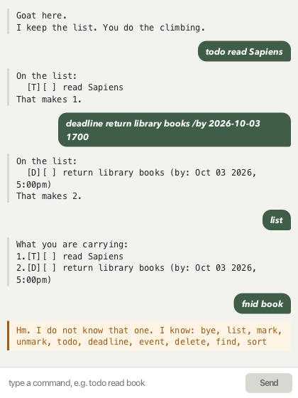

# Goat

**Goat is a task list you talk to.** Type what you need to do, and it keeps
track — todos, deadlines and events — in a window or in a terminal.



It saves after every change, so you can close it whenever you like.

## Getting started

1. Make sure you have **Java 25**. Check with `java -version`.
2. Download `goat.jar` from [the latest release](https://github.com/8ryanl33/ip/releases).
3. Put it in a folder of its own. Goat keeps your list in `data/goat.txt` next
   to the jar, so give it somewhere to live.
4. Open a command window in that folder and run:

   ```
   java -jar "goat.jar"
   ```

5. Type a command and press <kbd>Enter</kbd>. Start with `todo read a book`.

> If you mistype something, Goat tells you what to type instead. You do not
> need to memorise anything below.

## Features

### Add a todo — `todo`

Something to do, with no particular date.

```
todo read Sapiens
```

```
On the list:
  [T][ ] read Sapiens
That makes 1.
```

### Add a deadline — `deadline … /by …`

Something due at a particular time.

```
deadline return library books /by 2026-10-03 1700
```

```
On the list:
  [D][ ] return library books (by: Oct 03 2026, 5:00pm)
That makes 2.
```

### Add an event — `event … /from … /to …`

Something that runs from one time to another.

```
event standup /from 2026-09-22 0930 /to 2026-09-22 0945
```

```
On the list:
  [E][ ] standup (from: Sep 22 2026, 9:30am to: Sep 22 2026, 9:45am)
That makes 3.
```

### See everything — `list`

```
What you are carrying:
1.[T][ ] read Sapiens
2.[D][ ] return library books (by: Oct 03 2026, 5:00pm)
3.[E][ ] standup (from: Sep 22 2026, 9:30am to: Sep 22 2026, 9:45am)
```

`[T]`, `[D]` and `[E]` are todo, deadline and event. `[X]` means done.

### Tick something off — `mark` / `unmark`

Use the number from `list`.

```
mark 1
```

```
Done. One less to climb:
  [T][X] read Sapiens
```

`unmark 1` puts it back.

### Search — `find`

Matches anywhere in the description, and ignores capitals.

```
find book
```

```
Found these:
1.[D][ ] return library books (by: Oct 03 2026, 5:00pm)
```

### Put the list in order — `sort date` / `sort name`

`sort date` shows what is coming up first, with undated todos at the bottom.
`sort name` is alphabetical. The new order is kept.

```
sort date
```

```
Sorted by date.
1.[E][ ] standup (from: Sep 22 2026, 9:30am to: Sep 22 2026, 9:45am)
2.[D][ ] return library books (by: Oct 03 2026, 5:00pm)
3.[T][ ] read Sapiens
```

### Throw something away — `delete`

```
delete 3
```

```
Gone:
  [T][ ] read Sapiens
That leaves 2.
```

### Leave — `bye`

```
Off up the hill. The list keeps.
```

The window closes a moment later. Everything is already saved.

## Writing dates

Two forms, and Goat will remind you of both if you get it wrong:

| You mean | You type |
| --- | --- |
| A day | `2026-10-03` |
| A day and a time | `2026-10-03 1700` |

Times are 24-hour with no colon: `0930`, `1700`, `2359`.

## Command summary

| Command | Example |
| --- | --- |
| `todo` | `todo read Sapiens` |
| `deadline` | `deadline return books /by 2026-10-03 1700` |
| `event` | `event standup /from 2026-09-22 0930 /to 2026-09-22 0945` |
| `list` | `list` |
| `mark` / `unmark` | `mark 1` |
| `find` | `find book` |
| `sort` | `sort date` or `sort name` |
| `delete` | `delete 3` |
| `bye` | `bye` |

## Good to know

**Your list lives in `data/goat.txt`**, beside the jar, as plain text. You can
read it in any editor. If you edit it and get something wrong, Goat tells you
which line is at fault rather than losing the rest.

**Run it from the same folder each time.** Goat looks for `data/goat.txt`
relative to wherever the command was run, so starting it somewhere else gives
you a different, empty list.

**A description cannot contain `|`.** That character separates the fields in
the save file, so a description holding one could not be read back. Goat says
so rather than accepting it and losing half your task.

**Goat will not add the same thing twice**, and will not accept an event that
ends before it starts.

## If something goes wrong

| What you see | What it means |
| --- | --- |
| `Hm. I do not know that one…` | Not a command. The message lists the ones that are. |
| `Hm. There is no task '9'…` | No task has that number. Try `list`. |
| `Hm. I do not know the date…` | The date is not in one of the two forms above. |
| `Hm. The save file … is damaged on line 2` | A line in `data/goat.txt` cannot be read. Goat starts empty; fix that line before adding anything, or the file will be overwritten. |

**On an Apple Silicon Mac**, the jar needs a JDK that ships JavaFX (Azul Zulu
FX or Liberica Full). On a plain JDK you will see an error about architecture —
clone the repository and run `./gradlew run` instead.
